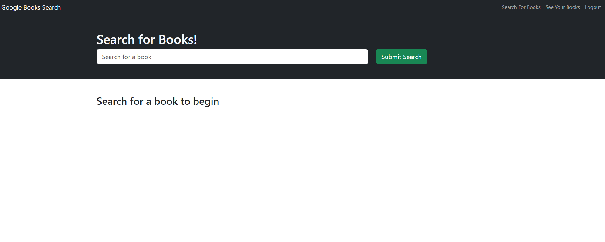
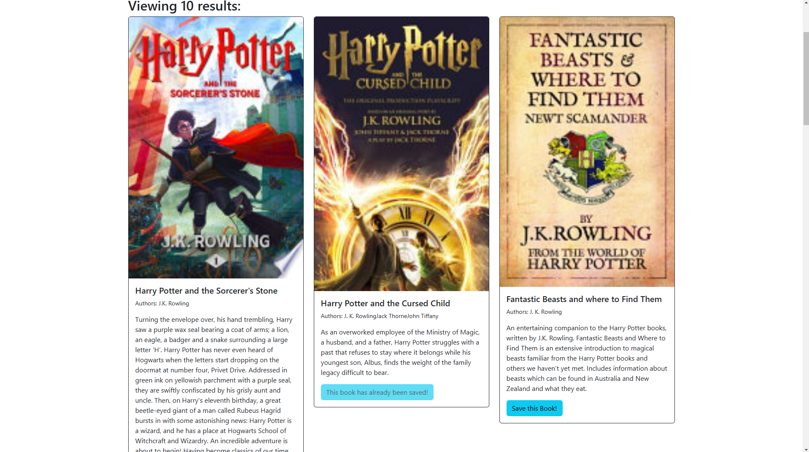
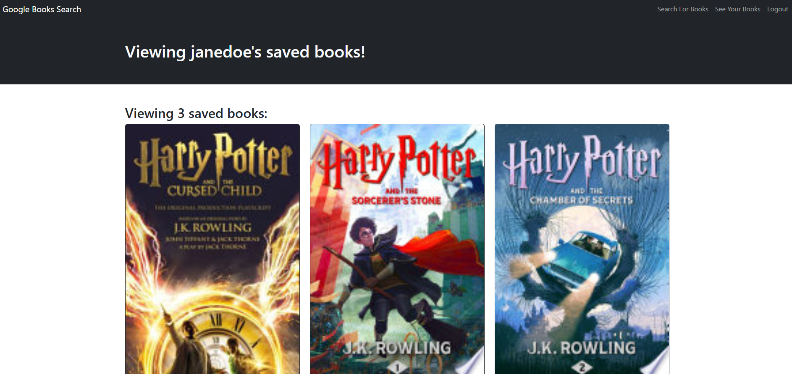

# Book-Search-Engine

## Description

A full-stack web application that allows readers to search for books, add books to a personal reading list and manage the reading list. 

## Table of Contents

- [Features](#features)
- [Technology Stack](#technology-stack)
- [Getting Started](#getting-started)
- [User Flow](#user-flow)
- [Screenshots](#screenshots)
- [Installation](#installation)
- [License](#license)
- [Acknowledgements](#acknowledgements)

## Features

This application has the following features: 
 * Book Search to allow users regargless of registration status to search for books using Google Books API
 * User Authentication for secure signup and login functionality
 * A Save Books feature for registered users to save books to a personal reading list. Registered users can view and manage their saved books by removing books from their personal reading 
 * Responsive design for desktop and mobile devices

## Technology Stack

This application uses the following technologies: 
| Frontend | Backend | Authentication | API |
|----------|---------|----------------|-----|
| React | GraphQL | JWT | Google Books API |
| TypeScript | Node.js | Apollo Client | Apollo Server |
| React Bootstrap | Express.js | | |

## User Flow

### Authentication
1. User arrives at the application and can choose to login or signup via modal
2. User provides credentials (email/password) and successfully authenticated users gain additional features 

### Book Search
1. Users can enter search term in search field and submit to view search results with book details
2. Logged-in users can save books to their reading list

### Saved Books
Registered users can save, view personal book collection and remove books from the list as desired

## Screenshots

Home Page 

Book Search 

Saved Books Feature 

## Installation

### Prerequisites
- Node.js (v14+)
- npm or yarn
- MongoDB

### Steps
```bash
# Clone the repository
git clone https://github.com/jackietng/Book-Search-Engine-Challenge-18.git 

# Navigate to project directory
cd Book-Search-Engine

# Install dependencies
npm install

# Set up environment variables
cp .env.example .env
# Edit .env with your configuration

# Run the application
npm run develop
```

### Environment Variables

| Variable | Description | Example |
|----------|-------------|---------|
| `MONGODB_URI` | MongoDB connection string | `mongodb://localhost:27017/booksearch` |
| `JWT_SECRET` | JSON Web Token secret | `its_a_secret` |
| `GOOGLE_BOOKS_API_KEY` | Optional Google Books API key | `AIza...` |

## License

Distributed under the MIT License. See `LICENSE` for more information.

## Acknowledgements

- [Google Books API](https://developers.google.com/books)
- [Apollo GraphQL](https://www.apollographql.com/)
- [React Bootstrap](https://react-bootstrap.github.io/)

